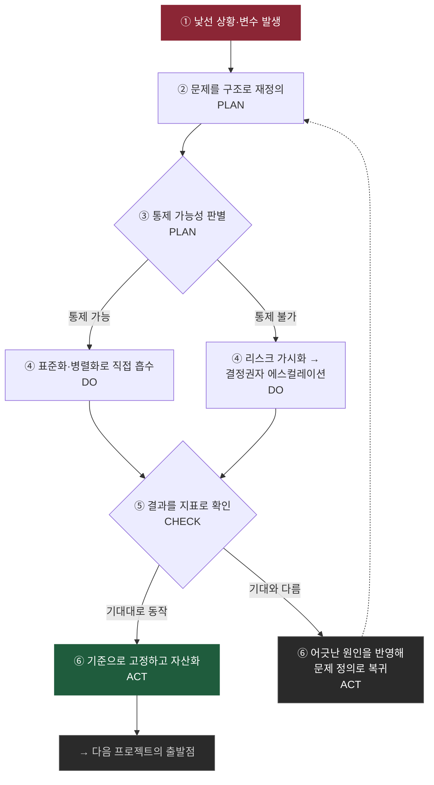
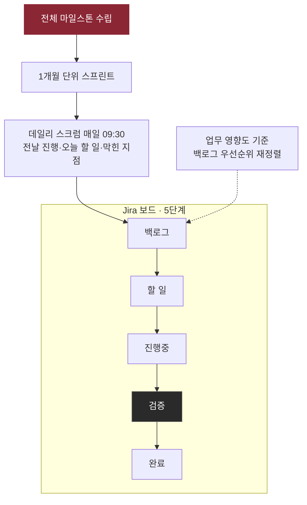
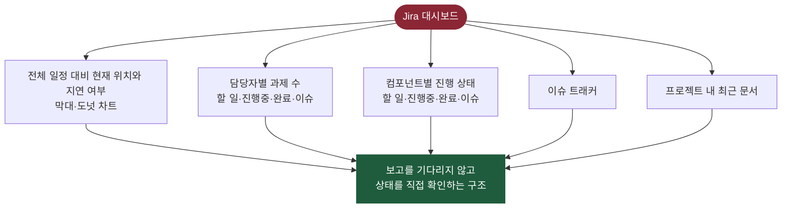
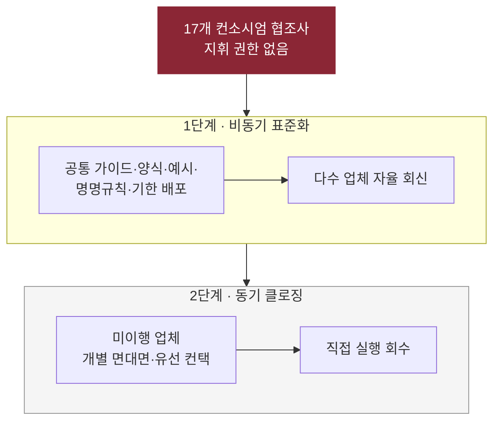
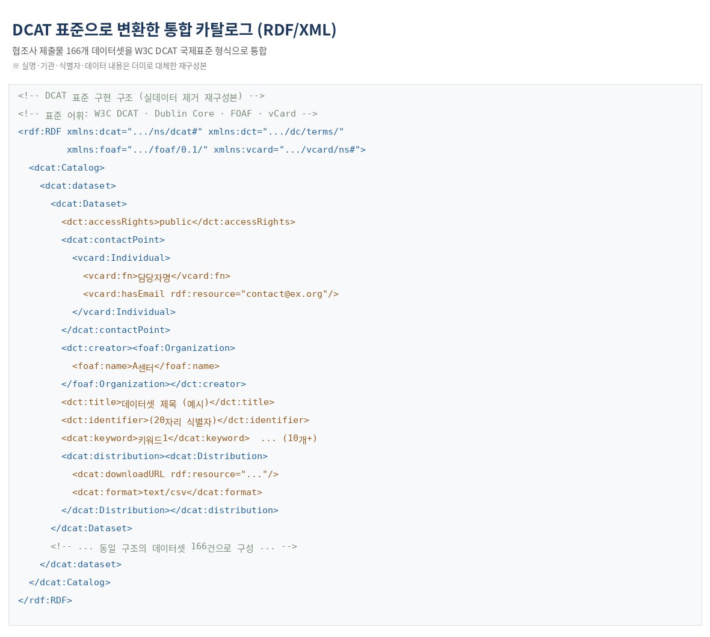
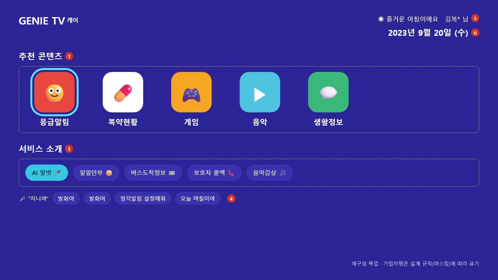
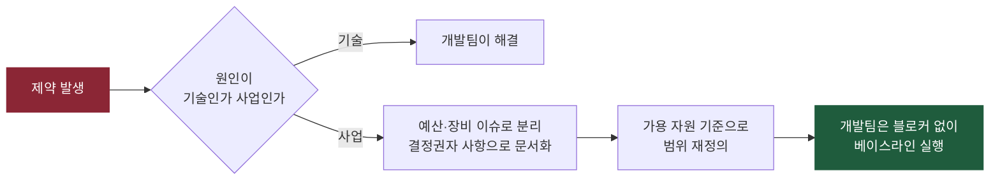
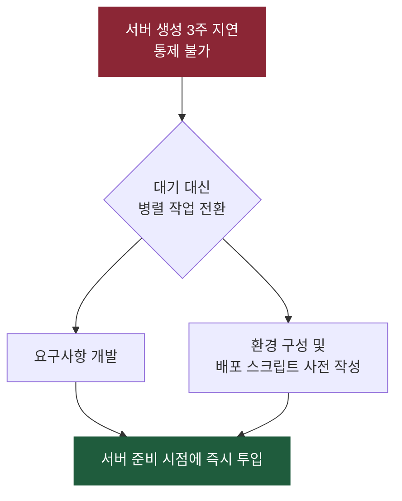

# 강미혜 포트폴리오

Project Manager / PL

kangmihye@gmail.com | [LinkedIn](https://www.linkedin.com/in/%EB%AF%B8%ED%98%9C-%EA%B0%95-1a29ba2b9/) | [인터뷰](https://m.blog.naver.com/ktds_official/222818903896)

> 이력서에 적은 결과가 **어떤 도구와 판단에서 나왔는지** 보여주는 문서입니다. 경력과 성과는 이력서를 참고해 주세요. 여기서는 제가 만든 구조와 산출물만 다룹니다.
>
> 실제 데이터는 모두 더미로 대체한 재구성본입니다.

---

## 1. 문제를 다루는 순서

> 복잡한 문제일수록 해결보다 문제 정의가 더 중요하다
>
> 제럴드 와인버그, 《대체 뭐가 문제야?》(Are Your Lights On?)

실행 압박이 큰 환경일수록 ②번을 건너뛰기 쉽습니다. 건너뛰면 뒤에서 더 큰 비용으로 돌아옵니다. 뒤에 나오는 네 개의 산출물은 모두 이 순서의 어느 한 단계에서 나왔습니다.

세운 기준이 기대대로 동작하지 않을 때도 있습니다. 그때는 어긋난 원인을 문제 정의로 되돌려 다시 돌립니다. 완료 기준 없이 진행했다가 테스트 직전에 문제가 드러난 경험이 이후 프로젝트의 검증 단계와 착수 시점 점검 항목으로 개선한 것이 그 예입니다.

---

## 2. 일정을 만드는 구조: 스프린트 보드

경쟁 PT라는 고정 일정을 맞춰야 했던 시니어케어 구축에서 쓴 운영 구조입니다.

보드에서 가장 중요하게 둔 것은 **검증을 별도 단계로 분리한 것**입니다. 개발이 끝난 항목이 바로 완료로 넘어가지 않도록, 완료 기준을 보드 구조 자체에 넣었습니다. 앞선 프로젝트에서 완료 기준 없이 진행했다가 테스트 직전에 문제가 드러났던 경험에서 나온 판단입니다.

백로그는 쌓인 순서가 아니라 업무 영향도를 기준으로 다시 세워 스프린트에 넣었습니다.

**판단 기록**

| 항목 | 내용 |
| --- | --- |
| 상황과 제약 | 경쟁 PT 전까지 1차 오픈이라는 고정 일정 |

---

## 3. 보이지 않던 것을 보이게 만들기

"진행 중"이라는 상태 보고로는 리스크가 드러나지 않습니다. 묻지 않아도 알 수 있는 상태를 만들었습니다.

### Jira 대시보드

다섯 개 위젯이 각각 다른 질문에 답하도록 구성했습니다.

### Confluence 이관 추적표

Azure 이관에서 Pod별 CI/CD 진행 상태는 WBS로 추적할 수 없었습니다. **추적 수단이 없다는 것 자체를 문제로 정의하고** 추적표를 만들어 관리 지표로 전환했습니다.

상단에 전체 진척률을 둡니다. 매일 같은 시각 기준으로 갱신해 어제와 비교할 수 있게 했습니다.

| 구분  | 이관 대상 | 배포 대상 | CI 진척률 | CD 진척률 |
| --- | ----- | ----- | ------ | ------ |
| 합계  | 81    | 61    | 99%    | 99%    |

완료를 선언하는 조건은 세 단계로 미리 정했습니다. 개발이 끝난 것과 동작하는 것을 구분하기 위해서입니다. 

| 단계  | 완료 조건                            |
| --- | -------------------------------- |
| 1차  | Build 및 배포 서비스 정상 구동             |
| 2차  | 서비스와 외부 구성요소(DB·메시지큐·캐시) 간 정상 연동 |
| 3차  | Pod 서비스 간 정상 연동                  |

서비스별로는 단계마다 상태를 표시했습니다. 비어 있는 칸이 곧 남은 일이라, 진행률을 세지 않아도 어디가 막혔는지 보입니다. 이 표로 진행률 99.8%까지 추적했습니다.

| No. | 서비스         | 배포  | dev | main | manifest | ArgoCD(dev) | ArgoCD(prd) | 담당  | 작업현황  | 이슈 유형          |
| --- | ----------- | --- | --- | ---- | -------- | ----------- | ----------- | --- | ----- | -------------- |
| 1   | svc-alpha   | O   | O   | O    | O        | O           | O           | A   | 1차 완료 |                |
| 2   | svc-bravo   | O   | O   | O    | O        | O           | X           | B   | 1차 완료 | PRD 미대상        |
| 3   | svc-charlie | O   | O   | O    | O        | O           | O           | A   | 1차 완료 | NEXUS, DB TEST |
| 4   | svc-delta   | X   | 미대상 | O    |          |             |             |     | 대상 외  | dev 브랜치 불필요    |
| 5   | svc-echo    | O   | O   | O    | 작업전      | 작업전         | 작업전         | C   | 착수 전  | 신규 생성          |

**판단 기록**

| 항목 | 내용 |
| --- | --- |
| 상황과 제약 | Pod별 진행 상태를 기존 WBS로 추적할 수 없던 상황 |

---

## 4. 외부 조직이 스스로 움직이게 만들기

지휘 권한도 보고 라인도 없는 17개사에서 산출물을 받아야 했습니다. 개별 요청으로는 감당할 수 없는 규모라, 요청하는 대신 **스스로 제출할 수 있는 도구**를 만들었습니다.

### 배포한 작성 가이드

생소한 국제 표준(DCAT)을 협조사가 그대로 따라 쓸 수 있는 양식으로 번역했습니다. 필드마다 작성 가이드와 예시를 붙여, 표준 문서를 읽지 않아도 채울 수 있게 했습니다.

| 필드명     | 필수/선택 | 작성 가이드                   | 작성 예시           |
| ------- | ----- | ------------------------ | --------------- |
| 접근권한    | 필수    | public / private 중 선택    | public          |
| 연락처-이름  | 필수    | 담당자 정보                   | 홍길동             |
| 생성자-기관명 | 필수    | 데이터 관리기관 정보              | A센터             |
| 설명      | 필수    | 데이터셋 상세 설명. 최소 50자 이상    | ○○ 분야의 ... 데이터셋 |
| 제목      | 필수    | 요약 제목. 서술식 배제, 단어 3개 이상  | ○○ 현황 데이터       |
| 생성일자    | 필수    | YYYY-MM-DD               | 2019-11-07      |
| 사용언어    | 필수    | ISO 639-1 2자리 코드         | ko              |
| 식별자     | 필수    | 플랫폼 내 unique 식별자         | (20자리 코드)       |
| 카테고리    | 필수    | 주제 분류 (복수는 쉼표로 구분)       | Public,Life     |
| 키워드     | 필수    | 의미기반 검색 핵심 항목. 최소 10개 이상 | 키워드1,키워드2,...   |
| 라이선스    | 필수    | 라이선스 문구                  | CC BY           |
| 배포주기    | 선택    | 배포 단위                    | 1M              |

### 회수한 결과물

제출받은 데이터를 W3C DCAT 국제표준 형식(RDF/XML)으로 통합했습니다.

**판단 기록**

| 항목 | 내용 |
| --- | --- |
| 상황과 제약 | 지휘 권한 없는 17개사에서 산출물을 받아야 하는 상황 |

---

## 5. 직접 기획한 화면: 지니 TV 케어

지니 TV 안에서 동작하는 케어 웹앱의 UI 설계서를 직접 작성했습니다. 2023년 10월 31일 최초 작성 이후 11월 한 달간 14차례 개정했고, 개정 이력의 작성자는 전부 저입니다.

개정 내용을 보면 무엇을 따라갔는지가 드러납니다. 예외처리와 오류 메시지, 보안성 검토 결과로 추가된 이름 마스킹 요건, 사업부서 피드백, 비즈니스 오류 정의, 리모컨 루핑 방식 변경 순입니다. 화면을 그리는 일보다 **화면이 실패할 때를 정의하는 일**에 분량이 더 들어갔습니다.

아래는 메인 페이지를 재구성한 목업입니다. 사내 산출물을 그대로 쓸 수 없어 구조만 다시 그렸고, 가입자명은 제가 정의한 마스킹 규칙대로 표기했습니다.

### 화면 구성에서 정한 규칙

TV는 마우스가 없고 리모컨 방향키로만 움직입니다. 그래서 "어디를 누를 수 있는가"를 화면마다 명시해야 했습니다.

| 영역 | 정한 규칙 |
| --- | --- |
| 섹션 라벨 | 리모컨 선택 불가. 단순 조회 영역으로 구분 |
| 추천 콘텐츠 | 아이콘 추가·삭제 가능. 7개 이상이면 리모컨 스크롤 |
| 서비스 소개 | 아이콘 추가·삭제 가능. 6개 이상이면 리모컨 스크롤 |
| 발화 가이드 | 3개까지 노출, 초과 시 위아래 토글. 발화 메시지 9종을 한 줄에 3건씩 롤링 |
| 가입자명 | 미가입자는 "고객 님". 이름은 마스킹 표기(예: 홍길*) |

리모컨 포커스 규칙은 개발 중 한 번 더 손봤습니다. 위 버튼은 좌우 방향키가 모두 있으면 우측, 한쪽만 있으면 그 방향으로 이동합니다. 아래 버튼은 '확인'과 '이전'으로 이동하고 더는 움직이지 않습니다. 게임 목록처럼 아이콘이 여러 줄인 화면에서는 좌우로 지그재그 이동하되 마지막 아이콘에서 우측을 누르면 첫 아이콘으로 돌아가고, 상하는 루핑하지 않도록 구분했습니다.

### 아이콘별 동작과 예외 처리

각 아이콘은 리모컨 선택과 음성 발화 두 경로로 진입합니다. 가입 여부에 따라 같은 아이콘이 다른 화면으로 가도록 설계했습니다.

| 아이콘 | 선택했을 때 | 예외 상황 | 그때의 처리 |
| --- | --- | --- | --- |
| 응급알림 | 레이어 팝업으로 최근 30일 이력 조회 | 미가입자 | 상품 안내 팝업으로 이동 |
| 응급알림 | 한 페이지에 1건씩 노출 | 조치내역 없음(상태가 조치완료 아님) | 해당 영역을 hidden 처리 |
| 응급알림 | 이력 2건 이상 | 앞뒤 데이터 유무 | 있는 방향의 꺾쇠만 활성화 |
| 복약현황 | 레이어 팝업으로 상세 조회 | 미가입자 | 상품 안내 팝업으로 이동 |
| 게임 | 레이어 팝업에서 선택 후 게임 웹앱으로 이동 | 게임 설명이 120자 초과 | 스크롤 대신 사업부서를 통해 문구 축소 |
| 발화 가이드 | 등록된 발화어 노출 | 발화 데이터 조회 안 됨 | toast 팝업으로 "등록된 발화어가 없습니다" |

### 오류를 화면 언어로 번역하기

API가 정상 연동됐더라도 오류 코드가 돌아오는 경우를 따로 다뤘습니다. 사용자에게 코드를 그대로 보여줄 수는 없고, 그렇다고 숨기면 상담 접수가 안 됩니다.

그래서 **"서비스 확인이 필요합니다. 서비스 운영자에게 문의해주세요"에 오류코드 네 자리를 덧붙이는 형식**으로 정했습니다. 사용자는 무엇을 해야 할지 알고, 상담 창구는 코드로 원인을 좁힐 수 있습니다. 말풍선은 3초 후 자동으로 닫히고, 길이는 최대 100자로 제한해 말줄임표가 생기지 않도록 사이즈를 문자 길이에 맞췄습니다.

처리결과코드는 성공, 인증 실패, 정보 없음, 서버 실패 등 13종을 공통으로 정의해 화면마다 다르게 처리하지 않도록 했습니다.

미가입자가 유료 기능을 선택했을 때는 오류가 아니라 **안내로 받았습니다.** 응급상황, 말벗, 복약일정, 문안인사 4단계 소개 페이지를 거쳐 가입 상담 번호로 이어지게 했습니다. 팝업이 열릴 때 리모컨 커서를 '확인'에 두고, 첫 페이지에서는 다음 꺾쇠만 보이게 해서 어르신이 길을 잃지 않도록 했습니다.

**판단 기록**

| 항목 | 내용 |
| --- | --- |
| 상황과 제약 | 리모컨 입력만 가능한 TV, 고령 사용자, 가입자와 미가입자가 같은 화면을 봄 |

---

## 6. 통제할 수 없는 것을 다루는 법

프로젝트에서 제 손 밖의 변수가 일정을 흔드는 일이 반복됐습니다. 두 가지로 나눠 다룹니다.

### 원인이 기술인지 사업인지 먼저 가른다

GPU를 확보하지 못해 모델 운영이 불가능해졌을 때, 그 원인이 기술적 한계가 아니라 예산과 장비 문제임을 구분했습니다. 개발팀이 풀 수 없는 문제를 개발팀의 블로커로 남기지 않기 위해서입니다.

### 기다려야 하는 시간을 생산 시간으로 바꾼다

서버 생성이 3주 지연됐을 때, 그것은 제가 당길 수 있는 일이 아니었습니다. 일정을 다투는 대신 서버 없이 할 수 있는 일을 앞으로 당겼습니다.

**판단 기록**

| 항목 | 내용 |
| --- | --- |
| 상황과 제약 | GPU 미확보와 서버 생성 3주 지연이라는 통제 밖 제약 |

